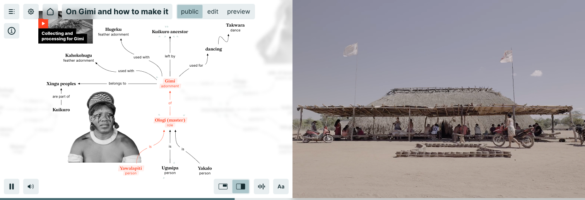

# Xingu Entangled

The indigenous communities of the Upper Xingu south of the Amazon river recognise objects, places, plants, myths, rites, and spiritual owners as intertwined entities that form entangled lifeworlds. However western museal practices centre on artefacts and divide them along disciplinary boundaries into separate institutions such as ethnological museums, botanical collections, and libraries. The Amazonia Future Lab develops new formats and tools to recontextualise Xingu artefacts into narratives that surface their complex interrelationships while adequately representing indigenous perspectives.

## Approach

Departing from historical-ethnographic and botanical collections from and about the Brazilian Amazon region, the Amazonia Future Lab shifts the focus from the discrete artefact to the relational context of its manufacturing process, its usage or its significance within traditional rituals. The aim of the project is to develop a framework that allows the contextualisation of data in a graph with meaningful relations and to render these relations navigable and narratable. As an intercultural and interdisciplinary team of designers, ethnologists, curators, botanists, and indigenous researchers, we further aim to support and adequately represent multiple knowledge systems.

